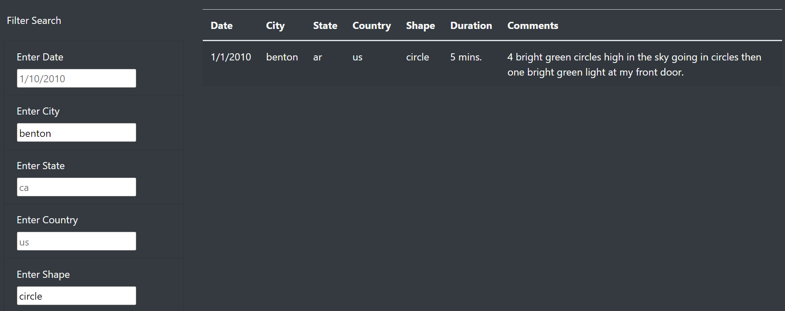

# UFOs

## Overview 

In this project, we helped Dana's webpage by providing a more in-depth analysis of UFO sightings. We did this by by allowing users to filter for multiple criteria at the same time. These criterias added in addition to the date, filters for the city, state, country, and shape. This is all to enhance the users experience when finding more information about UFO's. 

## Results

From our new filters, Dana and other users will have the opportunity to search for multiple and specific criterias from the data. Being able to search info by date is great but having the ability to search by a near city, the UFO's shape, or even an entirely different country helps in terms of how quick you can find the data you need. For example in the image below, if a user wants to find info regarding a UFO that has a circular shape and appeared in his hometown Benton, he will be able to find his result in a matter of seconds.

## Summary

From our design we achieved the goal to help users to have a more in-depth analysis however, there were drawbacks in this new design. For example, having an event as an input instead of a click. When testing out the data, we had eliminated the button feature for filter however on multiple times there was confusion based on how the old system worked. Although, we recommend adding code that can do both. Having the ability to click the fitler button and also search by inputting the enter key. Another suggestion would be to change the date filter to one that could do multiple dates instead of one. For example, what if users want to search data from January to March.
